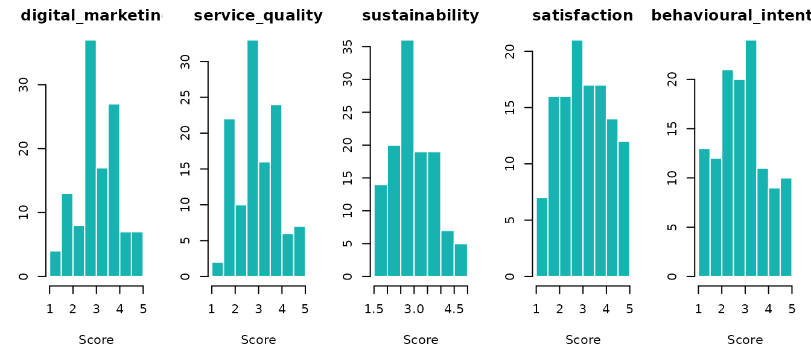
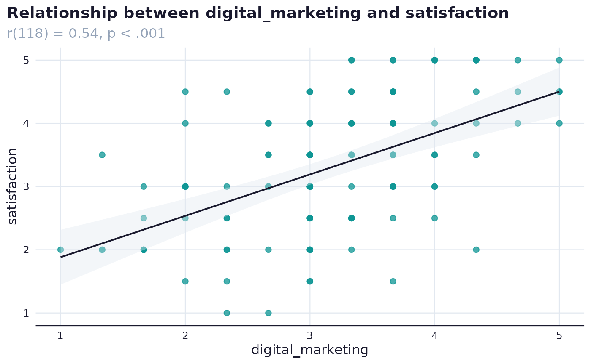

# Analysing survey responses: running the plan

The analysis in surveyframe is driven by the plan stored in the
instrument. Once responses are imported, scored, and checked,
[`run_analysis_plan()`](https://mohammedalisharafuddin.github.io/surveyframe/reference/run_analysis_plan.md)
runs every research question in one pass and returns results formatted
for reporting.

The worked-study vignette uses a published study whose data is private.
This vignette uses the bundled tourism demo, a synthetic dataset shaped
around the same digital marketing and tourism constructs, so the
analysis runs end to end without internet access or private data.

## Load the demo

``` r

demo      <- sframe_demo_data()
instr     <- demo$instrument
responses <- demo$responses

dim(responses)
#> [1] 120  18
```

## Import responses

Response data uses instrument item IDs as column names. Metadata columns
are declared explicitly. Use `strict = TRUE` to keep only known columns.

``` r

responses <- read_responses(
  demo$responses_path,
  instr,
  respondent_id = "respondent_id",
  submitted_at  = "submitted_at",
  meta_cols     = "started_at",
  strict        = TRUE
)

dim(responses)
#> [1] 120  18
```

## Missing data and quality

``` r

mr <- missing_data_report(responses, instr)
kable(mr$item_missing, digits = 2,
      col.names = c("Variable", "Missing (n)", "Missing (%)", "Valid (n)"),
      caption = "Item-level missingness")
```

|            | Variable   | Missing (n) | Missing (%) | Valid (n) |
|:-----------|:-----------|------------:|------------:|----------:|
| visit_type | visit_type |           0 |           0 |       120 |
| dm_1       | dm_1       |           0 |           0 |       120 |
| dm_2       | dm_2       |           0 |           0 |       120 |
| dm_3       | dm_3       |           0 |           0 |       120 |
| sq_1       | sq_1       |           0 |           0 |       120 |
| sq_2       | sq_2       |           0 |           0 |       120 |
| sq_3       | sq_3       |           0 |           0 |       120 |
| sus_1      | sus_1      |           0 |           0 |       120 |
| sus_2      | sus_2      |           0 |           0 |       120 |
| sat_1      | sat_1      |           0 |           0 |       120 |
| sat_2      | sat_2      |           0 |           0 |       120 |
| bi_1       | bi_1       |           0 |           0 |       120 |
| bi_2       | bi_2       |           0 |           0 |       120 |
| attention  | attention  |           0 |           0 |       120 |
| comments   | comments   |           0 |           0 |       120 |

Item-level missingness {.table}

``` r


qr <- quality_report(
  responses, instr,
  respondent_id = "respondent_id",
  submitted_at  = "submitted_at",
  started_at    = "started_at"
)
quality_summary <- data.frame(
  Metric = c("Respondents", "Items", "Flagged for review", "Flag rate"),
  Value  = c(qr$summary$n_respondents, qr$summary$n_items, qr$summary$n_flagged,
             sprintf("%.1f%%", 100 * qr$summary$flag_rate)),
  stringsAsFactors = FALSE
)
kable(quality_summary, align = c("l", "r"), caption = "Quality screening summary")
```

| Metric             | Value |
|:-------------------|------:|
| Respondents        |   120 |
| Items              |    15 |
| Flagged for review |   109 |
| Flag rate          | 90.8% |

Quality screening summary {.table}

## Score scales

[`run_analysis_plan()`](https://mohammedalisharafuddin.github.io/surveyframe/reference/run_analysis_plan.md)
scores the scales for you, but scoring once up front lets you inspect
the construct scores and run the assumption checks below.

``` r

scored    <- score_scales(responses, instr, keep_items = TRUE, keep_meta = TRUE)
scale_ids <- vapply(instr$scales, function(x) x$id, character(1))
score_cols <- intersect(scale_ids, names(scored))

kable(head(scored[, score_cols, drop = FALSE]), digits = 2,
      caption = "Scale scores, first respondents")
```

| digital_marketing | service_quality | sustainability | satisfaction | behavioural_intention |
|---:|---:|---:|---:|---:|
| 2.67 | 3.67 | 5.0 | 3.5 | 4.5 |
| 3.00 | 2.67 | 3.0 | 1.5 | 2.5 |
| 4.67 | 3.33 | 3.5 | 4.5 | 2.5 |
| 4.33 | 4.00 | 5.0 | 4.5 | 5.0 |
| 3.00 | 3.67 | 4.0 | 3.0 | 3.5 |
| 3.67 | 3.67 | 2.5 | 3.5 | 3.0 |

Scale scores, first respondents {.table}

The scale-score distributions show the shape of each construct before
the plan runs.

``` r

op <- par(mfrow = c(1, length(score_cols)), mar = c(4, 3, 2, 1))
for (s in score_cols) {
  v <- scored[[s]]; v <- v[is.finite(v)]
  hist(v, col = "#16B3B1", border = "white", main = s,
       xlab = "Score", ylab = "")
}
```



``` r

par(op)
```

## Check assumptions before the plan

[`assumption_report()`](https://mohammedalisharafuddin.github.io/surveyframe/reference/assumption_report.md)
reports the checks a technique relies on, such as residual normality,
variance inflation, and influence for a regression.

``` r

assumption_report(
  scored,
  predictors = c("digital_marketing", "service_quality", "sustainability"),
  outcome    = "satisfaction"
)
#> $method
#> [1] "assumptions"
#> 
#> $normality
#> data frame with 0 columns and 0 rows
#> 
#> $homogeneity
#> data frame with 0 columns and 0 rows
#> 
#> $regression
#> $regression$n
#> [1] 120
#> 
#> $regression$residual_shapiro_w
#> [1] 0.9941063
#> 
#> $regression$residual_shapiro_p
#> [1] 0.8980753
#> 
#> $regression$vif
#> digital_marketing   service_quality    sustainability 
#>          1.212656          1.200070          1.012163 
#> 
#> $regression$cooks_distance
#>            1            2            3            4            5            6 
#> 1.184326e-04 9.147336e-03 1.482864e-03 3.583748e-07 2.883541e-03 1.731349e-04 
#>            7            8            9           10           11           12 
#> 1.323697e-02 4.460344e-03 4.542716e-05 4.287879e-02 2.143130e-02 1.509419e-03 
#>           13           14           15           16           17           18 
#> 5.088239e-02 5.722577e-03 2.174172e-07 1.127457e-02 8.743696e-03 2.593670e-03 
#>           19           20           21           22           23           24 
#> 7.553824e-03 2.109049e-02 1.932134e-05 2.370723e-03 3.851322e-04 5.461064e-03 
#>           25           26           27           28           29           30 
#> 1.872377e-04 4.489098e-07 1.706497e-02 2.752537e-06 1.434770e-04 3.195816e-03 
#>           31           32           33           34           35           36 
#> 6.905977e-02 1.536396e-02 1.260801e-02 1.534755e-03 1.380360e-02 6.848461e-03 
#>           37           38           39           40           41           42 
#> 1.700720e-06 3.793174e-04 2.134337e-03 2.287672e-02 1.001287e-02 4.071700e-03 
#>           43           44           45           46           47           48 
#> 5.471299e-03 5.270891e-02 3.433051e-02 2.975180e-03 3.167244e-03 9.174703e-04 
#>           49           50           51           52           53           54 
#> 1.170983e-02 8.648779e-04 1.116591e-03 8.230930e-03 1.381027e-02 3.504105e-02 
#>           55           56           57           58           59           60 
#> 1.571502e-04 2.905749e-03 1.402942e-03 5.808575e-03 2.019476e-03 6.948885e-06 
#>           61           62           63           64           65           66 
#> 1.170618e-03 3.652109e-03 2.922443e-02 9.678057e-03 3.620026e-06 3.218468e-03 
#>           67           68           69           70           71           72 
#> 1.378174e-03 5.716292e-03 3.730149e-03 9.087202e-03 8.357802e-03 1.187750e-02 
#>           73           74           75           76           77           78 
#> 2.430428e-02 3.348263e-04 9.538221e-03 1.257656e-03 1.433252e-03 1.356868e-03 
#>           79           80           81           82           83           84 
#> 2.563597e-05 1.801658e-03 1.835160e-03 5.784606e-04 2.366539e-02 8.884675e-04 
#>           85           86           87           88           89           90 
#> 3.063566e-04 9.322376e-03 1.300065e-02 5.103375e-03 6.710071e-04 3.902158e-03 
#>           91           92           93           94           95           96 
#> 3.851322e-04 3.045158e-03 4.482863e-04 3.504325e-03 3.537797e-03 4.644052e-04 
#>           97           98           99          100          101          102 
#> 1.386934e-02 4.444185e-03 5.864202e-03 9.236185e-03 2.563387e-02 3.445601e-04 
#>          103          104          105          106          107          108 
#> 1.467024e-03 1.170618e-03 9.051071e-04 7.373574e-03 2.295924e-05 6.910949e-04 
#>          109          110          111          112          113          114 
#> 3.504325e-03 2.274586e-04 9.266580e-05 4.857092e-03 4.700977e-08 2.921484e-03 
#>          115          116          117          118          119          120 
#> 4.090240e-03 1.105467e-02 7.365409e-04 1.938023e-02 1.012910e-03 1.535916e-02 
#> 
#> $regression$standardised_residuals
#>            1            2            3            4            5            6 
#> -0.082923698 -1.870645918  0.395846500  0.004591293 -0.692174489 -0.185004873 
#>            7            8            9           10           11           12 
#>  1.084968504  0.780147050  0.110776991 -2.638742712 -1.795997774  0.319306483 
#>           13           14           15           16           17           18 
#>  1.954971640 -1.219815183  0.004191993  1.118225981  1.039309006  0.527129425 
#>           19           20           21           22           23           24 
#> -0.961835047  0.980099373  0.063225377  0.551354644  0.278271787 -0.647978136 
#>           25           26           27           28           29           30 
#>  0.227581315  0.004986299 -1.172216599  0.021868776 -0.095706217 -0.782623908 
#>           31           32           33           34           35           36 
#> -2.309384417 -1.374470793  0.932880267 -0.690640105  1.255066667  0.671314169 
#>           37           38           39           40           41           42 
#>  0.012570683  0.352662125  0.374079633  1.867781077 -1.228052989  0.606343018 
#>           43           44           45           46           47           48 
#> -0.617848955 -1.662835019  2.074446939  0.978590982 -0.793286443  0.252351509 
#>           49           50           51           52           53           54 
#>  1.156356561 -0.449473176 -0.363323806  1.152172372 -1.440809735 -1.866773520 
#>           55           56           57           58           59           60 
#>  0.189559954 -0.858506945 -0.309992596 -1.198889104  0.696726010 -0.035497078 
#>           61           62           63           64           65           66 
#> -0.594649744  0.646085118  1.892162918  1.346958028  0.012140769 -1.050312804 
#>           67           68           69           70           71           72 
#>  0.598618566 -1.508218399 -0.521321175 -0.874142231  1.497519709  1.032511438 
#>           73           74           75           76           77           78 
#>  2.208163710  0.178475846  1.021361391  0.616360158 -0.448239907 -0.298894184 
#>           79           80           81           82           83           84 
#> -0.041513884  0.484623799 -0.711839662 -0.445277725  2.271897566  0.424028147 
#>           85           86           87           88           89           90 
#>  0.236369610  1.923468863 -1.537113657 -0.910885755  0.287247717  0.885761213 
#>           91           92           93           94           95           96 
#>  0.278271787 -1.099326747 -0.299846917 -0.670336465  1.075297214  0.241274096 
#>           97           98           99          100          101          102 
#>  1.521915286  0.863717913  0.560137775 -0.839407809 -1.485896784 -0.173199125 
#>          103          104          105          106          107          108 
#> -0.230361700 -0.594649744  0.499913855 -1.172602644 -0.046456880 -0.397268813 
#>          109          110          111          112          113          114 
#> -0.670336465  0.181786019 -0.202323795 -0.825310891  0.001891811 -0.577856052 
#>          115          116          117          118          119          120 
#> -0.520419080  1.827370061 -0.348396466 -1.215115771  0.250475472  0.752951062 
#> 
#> 
#> $expected_counts
#> NULL
#> 
#> $apa
#> [1] "Assumption checks were computed."
#> 
#> $prompt
#> [1] "Report assumption checks before interpreting inferential models, especially sparse cells, non-normal residuals, and high VIF values."
#> 
#> attr(,"class")
#> [1] "sframe_assumption_report"
```

## Define the plan

Each block binds a research question to a technique and to the variables
that fill each role. A correlation expects `x` and `y`. A regression
expects `predictors` and a `dependent` variable. A group comparison
expects a `group` and an `outcome`.

``` r

instr$analysis_plan <- list(
  list(id = "RQ1",
       research_question = "Is digital marketing perception associated with satisfaction?",
       family = "association", method = "correlation_pearson",
       roles = list(x = "digital_marketing", y = "satisfaction"),
       options = list(alpha = 0.05)),
  list(id = "RQ2",
       research_question = "Do the three perception scales predict satisfaction?",
       family = "regression", method = "regression_linear",
       roles = list(predictors = c("digital_marketing", "service_quality", "sustainability"),
                    dependent = "satisfaction"),
       options = list(alpha = 0.05)),
  list(id = "RQ3",
       research_question = "Do first-time and repeat visitors differ in behavioural intention?",
       family = "group_comparison", method = "mann_whitney",
       roles = list(group = "visit_type", outcome = "behavioural_intention"),
       options = list(alpha = 0.05))
)
```

## Run the plan

``` r

results <- run_analysis_plan(responses, instr)
results_table(results)
```

| RQ | Research question | Method | Result (APA) | Effect |
|:---|:---|:---|---:|:---|
| RQ1 | Is digital marketing perception associated with satisfaction? | pearson | r(118) = 0.54, p \< .001 | large |
| RQ2 | Do the three perception scales predict satisfaction? |  | R² = 0.383, F(3, 116) = 23.95, p \< .001 |  |
| RQ3 | Do first-time and repeat visitors differ in behavioural intention? |  | U = 1576, z = -0.98, p = 0.327, r = 0.09 | negligible |

Pass `plots = TRUE` to attach a brand-styled `ggplot2` chart to each
result that supports one (descriptive, correlation, chi-square, and
regression blocks). The chart sits in `$plot` alongside the existing
`$table` and `$apa` elements.

``` r

results_plots <- run_analysis_plan(responses, instr, plots = TRUE)
results_plots[[1]]$plot
```



## Read a single result

Each result holds more than the printed line. It carries the APA
statistic, the effect-size label where the technique reports one, a
writing prompt, and the references that support the technique.

``` r

rq1 <- results[[1]]

rq1$apa
#> [1] "r(118) = 0.54, p < .001"
rq1$effect_label
#> [1] "large"
rq1$prompt
#> [1] "There was a positive, large significant correlation between digital_marketing and satisfaction, r(118) = 0.54, p < .001. Explain what this means for your research question."
unlist(rq1$citations)
#>                                                                                                                                                         field_2018 
#>                                                                            "Field, A. (2018). *Discovering statistics using IBM SPSS statistics* (5th ed.). SAGE." 
#>                                                                                                                                                         cohen_1988 
#>                                                          "Cohen, J. (1988). *Statistical power analysis for the behavioral sciences* (2nd ed.). Lawrence Erlbaum." 
#>                                                                                                                                                             r_core 
#>                                          "R Core Team. (2026). *R: A language and environment for statistical computing*. R Foundation for Statistical Computing." 
#>                                                                                                                                                        surveyframe 
#> "Sharafuddin, M. A. (2026). *surveyframe: Survey Instrument Workflows* (Version 0.3.3) [Computer software]. https://github.com/MohammedAliSharafuddin/surveyframe"
```

## Render the results report

[`render_results()`](https://mohammedalisharafuddin.github.io/surveyframe/reference/render_results.md)
writes a self-contained HTML report with one section per research
question, each holding the APA result, the writing prompt, a space for
the interpretation, and a reference list compiled from the techniques
used.

``` r

render_results(results, instr, output_file = "results.html", citation_format = "apa")
```

## In SurveyStudio

SurveyStudio runs the same plan. Open it on the analysis screen, upload
the responses, and the Analysis Plan screen runs the saved plan and
shows a table of each question with its method and APA result. The full
report is produced on the Export screen.

``` r

launch_studio(
  instrument     = instr,
  responses      = responses,
  screen         = "analysis",
  launch.browser = FALSE
)
```
