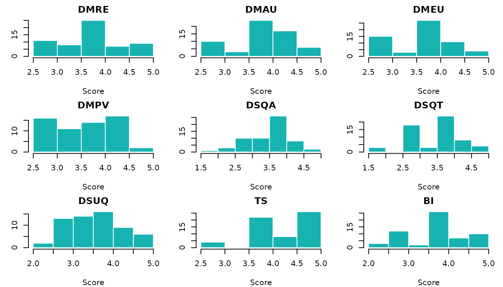
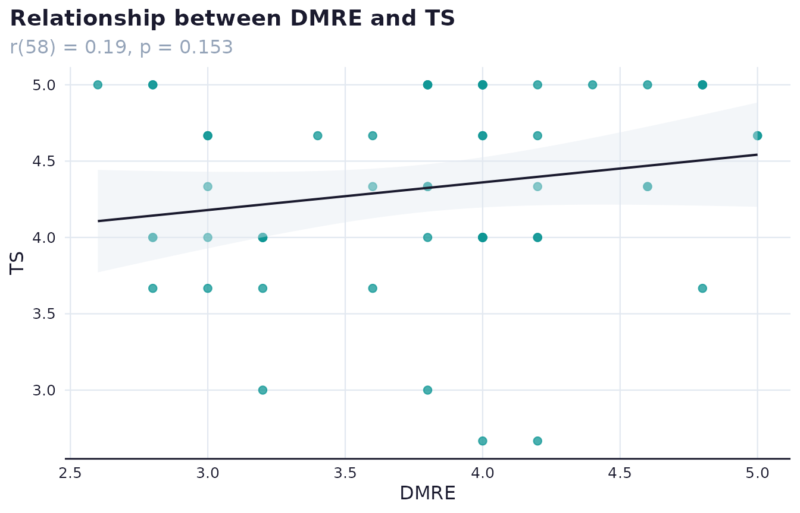

# Survey design and live results: a tourism services example

## About this vignette

This vignette follows a single instrument through the complete
surveyframe workflow: design the questionnaire, export it as a hosted
survey with a Google Sheets backend, collect responses, clean and score
them, run the analysis plan, and render a results report. The results
section uses 60 simulated responses so the vignette builds offline.
Replacing the simulated data with a call to
[`read_sheet_responses()`](https://mohammedalisharafuddin.github.io/surveyframe/reference/read_sheet_responses.md)
connects the same workflow to live responses that grow with each
submission.

The questionnaire and concept are adopted from:

> Sharafuddin, M. A., Madhavan, M., & Wangtueai, S. (2024). Assessing
> the Effectiveness of Digital Marketing in Enhancing Tourist
> Experiences and Satisfaction: A Study of Thailand’s Tourism Services.
> *Administrative Sciences*, *14*(11), 273.
> <https://doi.org/10.3390/admsci14110273>

The instrument covers five research areas applicable to any tourism
services context: digital marketing effectiveness (relevance,
accessibility, ease of use, and perceived value), destination service
quality (accommodation and local transport), destination sustainability
quality, tourist satisfaction, and behavioural intention. The item
wording is reproduced from the original questionnaire. Researchers
studying other destinations can adapt the scales and analysis plan to
their own context.

------------------------------------------------------------------------

## The questionnaire

### Shared Likert scale

All rated items use a five-point agreement scale.

``` r

likert5 <- sf_choices(
  "likert5",
  values = 1:5,
  labels = c("Strongly disagree", "Disagree",
             "Neither agree nor disagree", "Agree", "Strongly agree")
)
```

### Helper functions

`stem_items()` builds items that share a common sentence stem. Each item
is the stem followed by a unique completion. `solo_items()` builds
standalone items. Neither function is exported, and both use only
[`sf_item()`](https://mohammedalisharafuddin.github.io/surveyframe/reference/sf_item.md).

``` r

stem_items <- function(ids, stem, completions, scale_id) {
  Map(
    function(id, comp)
      sf_item(id, paste(stem, comp),
              type = "likert", required = TRUE,
              choice_set = "likert5", scale_id = scale_id),
    ids, completions
  )
}

solo_items <- function(ids, labels, scale_id) {
  Map(
    function(id, lab)
      sf_item(id, lab,
              type = "likert", required = TRUE,
              choice_set = "likert5", scale_id = scale_id),
    ids, labels
  )
}
```

### Digital marketing items

**Relevance and engagement (DMRE, 5 items)**

``` r

dmre_stem <- paste(
  "The digital marketing contents I encountered during my",
  "trip planning and booking phases were"
)
dmre_completions <- c(
  "relevant to my interests.",
  "engaging.",
  "customisable.",
  "flexible and I was able to make real-time adjustments for my demand.",
  "able to cater to my specific needs and preferences."
)
dmre_items <- stem_items(
  paste0("dmre_", 1:5), dmre_stem, dmre_completions, "DMRE"
)
```

**Accessibility and usefulness (DMAU, 5 items)**

``` r

dmau_stem <- "The contents, communication, and booking services were"
dmau_completions <- c(
  "easy to find so I could contact service providers and book my trip directly.",
  "fast.",
  "efficient.",
  "of good quality.",
  "user friendly."
)
dmau_items <- stem_items(
  paste0("dmau_", 1:5), dmau_stem, dmau_completions, "DMAU"
)
```

**Ease of use (DMEU, 5 items)**

``` r

dmeu_stem <- paste(
  "The digital marketing contents and procedures regarding",
  "trip planning and booking were"
)
dmeu_completions <- c(
  "easy to learn.",
  "understandable and required little mental effort.",
  "neat and simple.",
  "easy to follow.",
  "mobile friendly."
)
dmeu_items <- stem_items(
  paste0("dmeu_", 1:5), dmeu_stem, dmeu_completions, "DMEU"
)
```

**Perceived value (DMPV, 5 items)**

``` r

dmpv_stem <- paste(
  "In terms of value, both the commercial and",
  "user-generated contents are"
)
dmpv_completions <- c(
  "sufficient to support eco-friendly practices.",
  "appropriate.",
  "trustworthy and credible.",
  "consistent across all digital platforms.",
  "value for money."
)
dmpv_items <- stem_items(
  paste0("dmpv_", 1:5), dmpv_stem, dmpv_completions, "DMPV"
)
```

### Destination service quality items

**Accommodation (DSQA, 4 items)**

``` r

dsqa_stem <- "The accommodation related services met my expectations for"
dsqa_completions <- c(
  "check-in and check-out services.",
  "room cleanliness.",
  "staff attitude.",
  "safety and security."
)
dsqa_items <- stem_items(
  paste0("dsqa_", 1:4), dsqa_stem, dsqa_completions, "DSQA"
)
```

**Local transport (DSQT, 5 items)**

``` r

dsqt_stem <- "The local transport related services met my expectations for"
dsqt_completions <- c(
  "frequency.",
  "connectivity.",
  "comfort.",
  "staff attitude.",
  "ride safety."
)
dsqt_items <- stem_items(
  paste0("dsqt_", 1:5), dsqt_stem, dsqt_completions, "DSQT"
)
```

### Destination sustainability quality (DSUQ, 11 items)

``` r

dsuq_labels <- c(
  "I can easily find and purchase locally-made handicrafts and souvenir products.",
  "The livelihoods of local vendors and artisans are respected, and fair prices are paid for their products.",
  "The size of food portions sold is adequate, reducing waste and leftovers.",
  "Awareness programmes are adequate in encouraging me to reduce water consumption.",
  "There are enough local guides with in-depth knowledge to enhance my travel experience.",
  "Sustainable transport options such as bikes, walking routes, and public transport are adequate.",
  "Reusable bags are adequately available for purchase.",
  "Digital infrastructure is adequate so that I can avoid printing and use digital copies.",
  "There are adequate choices of sustainable seafood in the destination.",
  "There are enough litter bins throughout the destination.",
  "There are adequate awareness signs about endangered marine species, plants, and animals."
)
dsuq_items <- solo_items(paste0("dsuq_", 1:11), dsuq_labels, "DSUQ")
```

### Tourist satisfaction (TS, 3 items) and behavioural intention (BI, 3 items)

``` r

ts_items <- solo_items(
  paste0("ts_", 1:3),
  c(
    "The destination met or exceeded my expectations.",
    "Overall, my travel experience with the destination was good.",
    "Overall, I felt comfortable in the destination."
  ),
  "TS"
)

bi_items <- solo_items(
  paste0("bi_", 1:3),
  c(
    "I will recommend others to use online platforms for planning and booking their trips.",
    "I will share my experience online.",
    "I intend to revisit the destination."
  ),
  "BI"
)
```

### Demographic items

``` r

gender_cs    <- sf_choices("gender",
  c("male", "female", "transgender"), c("Male", "Female", "Transgender"))

age_cs       <- sf_choices("age",
  c("18_25", "26_40", "41_50", "51_60", "60_plus"),
  c("18-25", "26-40", "41-50", "51-60", "60 and above"))

visitor_cs   <- sf_choices("visitor",
  c("first_time", "repeat"),
  c("First-time visitor", "Repeated visitor"))

freq_cs      <- sf_choices("freq_visit",
  c("lt_1", "once", "2_3", "gt_3"),
  c("Less than 1 time in a year", "Once in a year",
    "2-3 times in a year", "More than 3 times in a year"))

nationality_cs <- sf_choices("nationality",
  c("thai", "chinese", "japanese", "korean", "indian", "australian",
    "british", "german", "american", "other"),
  c("Thai", "Chinese", "Japanese", "Korean", "Indian", "Australian",
    "British", "German", "American", "Other"))

education_cs <- sf_choices("education",
  c("high_school", "diploma", "undergraduate", "post_graduate"),
  c("High school", "Diploma", "Undergraduate", "Post graduate"))

profession_cs <- sf_choices("profession",
  c("student", "business", "salaried", "freelancer", "not_working"),
  c("Student", "Business", "Salaried and working", "Freelancer",
    "Not working (housewife or retired)"))

companion_cs <- sf_choices("companion",
  c("friends", "family", "other"),
  c("Friends", "Family members", "Other"))

group_cs     <- sf_choices("group_size",
  c("lt_3", "3_5", "gt_5"),
  c("Less than 3", "3-5", "More than 5"))

demo_items <- list(
  sf_item("gender",        "Gender",                type = "single_choice",
          required = TRUE, choice_set = "gender"),
  sf_item("age_band",      "Age",                   type = "single_choice",
          required = TRUE, choice_set = "age"),
  sf_item("visitor_type",  "I am",                  type = "single_choice",
          required = TRUE, choice_set = "visitor"),
  sf_item("freq_visit",    "Frequency of visit",    type = "single_choice",
          required = TRUE, choice_set = "freq_visit"),
  sf_item("nationality",   "Nationality",           type = "single_choice",
          required = TRUE, choice_set = "nationality"),
  sf_item("education",     "Education level",       type = "single_choice",
          required = TRUE, choice_set = "education"),
  sf_item("profession",    "Profession",            type = "single_choice",
          required = TRUE, choice_set = "profession"),
  sf_item("companion",     "I visit with my",       type = "single_choice",
          required = TRUE, choice_set = "companion"),
  sf_item("group_size",    "My travel group size is", type = "single_choice",
          required = TRUE, choice_set = "group_size")
)
```

### Scales

``` r

make_scale <- function(id, label, ids) {
  sf_scale(id, label, items = ids, method = "mean")
}

scales <- list(
  make_scale("DMRE", "Digital marketing: relevance and engagement",  paste0("dmre_", 1:5)),
  make_scale("DMAU", "Digital marketing: accessibility and usefulness", paste0("dmau_", 1:5)),
  make_scale("DMEU", "Digital marketing: ease of use",               paste0("dmeu_", 1:5)),
  make_scale("DMPV", "Digital marketing: perceived value",           paste0("dmpv_", 1:5)),
  make_scale("DSQA", "Destination service quality: accommodation",   paste0("dsqa_", 1:4)),
  make_scale("DSQT", "Destination service quality: transport",       paste0("dsqt_", 1:5)),
  make_scale("DSUQ", "Destination sustainability quality",           paste0("dsuq_", 1:11)),
  make_scale("TS",   "Tourist satisfaction",                         paste0("ts_",   1:3)),
  make_scale("BI",   "Behavioural intention",                        paste0("bi_",   1:3))
)
```

### Assemble the instrument

``` r

choice_sets <- list(
  likert5, gender_cs, age_cs, visitor_cs, freq_cs, nationality_cs,
  education_cs, profession_cs, companion_cs, group_cs
)

rated_items <- c(dmre_items, dmau_items, dmeu_items, dmpv_items,
                 dsqa_items, dsqt_items, dsuq_items, ts_items, bi_items)

study <- sf_instrument(
  title       = "Digital Marketing Effectiveness of Tourism Services",
  version     = "1.0.0",
  description = paste(
    "Questionnaire covering digital marketing effectiveness,",
    "destination service quality, sustainability quality,",
    "tourist satisfaction, and behavioural intention.",
    "Adopted from Sharafuddin, Madhavan & Wangtueai (2024),",
    "Administrative Sciences, 14(11), 273.",
    "https://doi.org/10.3390/admsci14110273"
  ),
  authors   = "Mohammed Ali Sharafuddin",
  languages = "en",
  components = c(choice_sets, rated_items, demo_items, scales)
)

study
#> <sframe>
#>   Title:      Digital Marketing Effectiveness of Tourism Services
#>   Version:    1.0.0
#>   Items:      55
#>   Scales:     9
#>   Status:     not validated
```

------------------------------------------------------------------------

## Validate and serialise

[`validate_sframe()`](https://mohammedalisharafuddin.github.io/surveyframe/reference/validate_sframe.md)
checks every item ID, choice set reference, and scale membership before
any data is collected.
[`write_sframe()`](https://mohammedalisharafuddin.github.io/surveyframe/reference/write_sframe.md)
saves the validated instrument with a SHA-256 hash so any
post-collection edits are detectable.

``` r

v <- validate_sframe(study, strict = FALSE)
v$valid
#> [1] TRUE
length(v$problems)
#> [1] 0
```

``` r

# Save the instrument. Keep this file alongside your analysis script.
sframe_path <- write_sframe(study, file.path(tempdir(), "tourism_services_v1.sframe"),
                             overwrite = TRUE)

# Reload the instrument from disk at any time with:
study2 <- read_sframe(sframe_path)
identical(study$meta$title, study2$meta$title)
#> [1] TRUE
```

------------------------------------------------------------------------

## Set up data collection

### Store the Google Sheets endpoint in the instrument

When an endpoint URL is set on the instrument,
[`export_static_survey()`](https://mohammedalisharafuddin.github.io/surveyframe/reference/export_static_survey.md)
reads it automatically. Set the URL once, export as many times as needed
without repeating the argument.

``` r

# Replace with your deployed Apps Script URL after the setup steps below.
study$render$google_sheets_endpoint <-
  "https://script.google.com/macros/s/YOUR_SCRIPT_ID/exec"
```

### Export the static HTML survey

[`export_static_survey()`](https://mohammedalisharafuddin.github.io/surveyframe/reference/export_static_survey.md)
produces a single self-contained HTML file. Respondents open it in any
browser, fill it in, and their submission is downloaded as a CSV and, if
an endpoint is configured, posted to the Google Sheet at the same time.
The file can be hosted on GitHub Pages, shared by email, or opened
directly from disk.

``` r

html_path <- export_static_survey(
  study,
  output_path = file.path(tempdir(), "tourism_services_survey.html"),
  open        = FALSE
)
#> Static survey written to '/tmp/RtmpJJ679d/tourism_services_survey.html' (65.3
#> KB).
file.exists(html_path)
#> [1] TRUE
```

### What the respondent sees

The exported survey carries its own design, independent of the
SurveyBuilder or SurveyStudio chrome used to build it. Question text
sits in a serif typeface, options render as bordered cards with a
selection tick, Likert items render as numbered squares, and a slim
progress bar tracks completion. Every one of those colours derives from
the instrument’s single theme colour, so the line below re-skins the
whole survey without touching anything else.

``` r

study$render$theme <- "#0f766e"
```

Two things about the export matter for planning a real deployment.

- **It is designed for a phone first.** Option cards and touch targets
  meet a 44 pixel minimum, and a matrix question (see the input-types
  demo in the SurveyBuilder vignette) reflows from a table into stacked,
  labelled cards below 600 pixels of width, so no question ever needs
  horizontal scrolling to complete on a small screen.
- **It meets WCAG 2.2 AA.** Every control carries an accessible name,
  keyboard focus is visible on option cards, a validation error is
  announced to assistive technology, and required questions are marked
  by more than colour alone.

### Generate the Google Sheets collector script

[`export_google_sheet()`](https://mohammedalisharafuddin.github.io/surveyframe/reference/export_google_sheet.md)
writes a Google Apps Script file. Deploy it in a Google Sheet and it
creates a response tab with the correct column headers. Matrix,
multiple-choice, and ranking questions each need more than one column,
so the collector expands them automatically: a matrix gets one column
per row, a multiple-choice question gets one 0/1 column per option, and
a ranking question gets one column per option holding its rank. A
five-option multiple-choice item named `channels`, for example, becomes
five columns, `channels__option1` through `channels__option5`, each
holding `0` or `1`, ready for analysis with no string-splitting step.

``` r

script_path <- export_google_sheet(
  study,
  sheet_url  = "https://docs.google.com/spreadsheets/d/YOUR_SHEET_ID",
  output_dir = tempdir()
)
#> Apps Script written to: /tmp/RtmpJJ679d/surveyframe_collector.gs
#> Follow the setup instructions inside the file to deploy it.
file.exists(script_path)
#> [1] TRUE
```

**To deploy the script:**

1.  Open or create a Google Sheet.
2.  Click Extensions, then Apps Script.
3.  Paste the contents of the generated `.gs` file, replacing any
    existing code.
4.  Click Deploy, then New deployment. Set type to Web app.
5.  Set “Who has access” to Anyone.
6.  Copy the Web App URL.
7.  Paste the URL into `study$render$google_sheets_endpoint` above and
    re-export the survey.

### Pull live responses

Once the survey is live, read the growing response set with one call.
Re-run this line and everything below it to refresh all results.

``` r

responses <- read_sheet_responses(
  sheet_id   = "YOUR_SHEET_ID",
  instrument = study
)
```

------------------------------------------------------------------------

## Simulated responses for offline demonstration

The code block below generates 60 plausible responses so the remainder
of this vignette runs without a network connection. Replace `responses`
with the output of
[`read_sheet_responses()`](https://mohammedalisharafuddin.github.io/surveyframe/reference/read_sheet_responses.md)
and re-run from the quality section onward to use real data.

``` r

set.seed(2024)
n <- 60

# Each construct is driven by a latent score plus item-level noise.
# Correlations between constructs are introduced by sharing variance.
lat <- function(mu, sigma) pmax(1, pmin(5, round(rnorm(n, mu, sigma))))
add_noise <- function(x, sigma = 0.45) {
  pmax(1L, pmin(5L, as.integer(round(x + rnorm(n, 0, sigma)))))
}

# Higher service quality and sustainability lift satisfaction.
lat_dsqa <- lat(3.7, 0.6)
lat_dsqt <- lat(3.6, 0.6)
lat_dsuq <- lat(3.5, 0.6)
lat_ts   <- pmax(1, pmin(5, round(
  0.4 * lat_dsqa + 0.3 * lat_dsqt + 0.2 * lat_dsuq + rnorm(n, 0.6, 0.3)
)))
lat_bi   <- pmax(1, pmin(5, round(0.7 * lat_ts + rnorm(n, 0.5, 0.4))))

# Digital marketing constructs are loosely correlated with each other.
lat_dmre <- lat(3.8, 0.6)
lat_dmau <- pmax(1, pmin(5, round(0.5 * lat_dmre + rnorm(n, 1.9, 0.4))))
lat_dmeu <- pmax(1, pmin(5, round(0.4 * lat_dmre + rnorm(n, 2.2, 0.4))))
lat_dmpv <- pmax(1, pmin(5, round(0.3 * lat_dmre + rnorm(n, 2.5, 0.4))))

# Repeat visitors score slightly higher on satisfaction and intention.
visitor_type <- sample(c("first_time", "repeat"), n,
                       replace = TRUE, prob = c(0.45, 0.55))
lat_ts[visitor_type == "repeat"] <- pmin(5L, lat_ts[visitor_type == "repeat"] + 1L)
lat_bi[visitor_type == "repeat"] <- pmin(5L, lat_bi[visitor_type == "repeat"] + 1L)

# Build item columns from latent scores.
make_cols <- function(lat, k, prefix) {
  setNames(
    as.data.frame(
      vapply(seq_len(k), function(i) add_noise(lat), integer(n))
    ),
    paste0(prefix, seq_len(k))
  )
}

sim_df <- cbind(
  data.frame(
    respondent_id = sprintf("R%03d", seq_len(n)),
    submitted_at  = format(
      seq(as.POSIXct("2025-01-10 09:00", tz = "UTC"),
          by = "1 hour", length.out = n),
      "%Y-%m-%dT%H:%M:%SZ"
    ),
    started_at = format(
      seq(as.POSIXct("2025-01-10 08:50", tz = "UTC"),
          by = "1 hour", length.out = n),
      "%Y-%m-%dT%H:%M:%SZ"
    ),
    gender = sample(c("male", "female", "transgender"),
                    n, TRUE, c(0.44, 0.55, 0.01)),
    age_band = sample(c("18_25", "26_40", "41_50", "51_60", "60_plus"),
                      n, TRUE, c(0.15, 0.40, 0.25, 0.15, 0.05)),
    visitor_type = visitor_type,
    freq_visit = sample(c("lt_1", "once", "2_3", "gt_3"),
                        n, TRUE, c(0.15, 0.25, 0.35, 0.25)),
    nationality = sample(
      c("thai", "chinese", "japanese", "korean", "indian",
        "australian", "british", "german", "american", "other"),
      n, TRUE),
    education = sample(c("high_school", "diploma", "undergraduate", "post_graduate"),
                       n, TRUE, c(0.05, 0.10, 0.48, 0.37)),
    profession = sample(c("student", "business", "salaried", "freelancer", "not_working"),
                        n, TRUE, c(0.15, 0.20, 0.45, 0.12, 0.08)),
    companion = sample(c("friends", "family", "other"),
                       n, TRUE, c(0.35, 0.55, 0.10)),
    group_size = sample(c("lt_3", "3_5", "gt_5"),
                        n, TRUE, c(0.30, 0.50, 0.20)),
    stringsAsFactors = FALSE
  ),
  make_cols(lat_dmre, 5, "dmre_"),
  make_cols(lat_dmau, 5, "dmau_"),
  make_cols(lat_dmeu, 5, "dmeu_"),
  make_cols(lat_dmpv, 5, "dmpv_"),
  make_cols(lat_dsqa, 4, "dsqa_"),
  make_cols(lat_dsqt, 5, "dsqt_"),
  make_cols(lat_dsuq, 11, "dsuq_"),
  make_cols(lat_ts,   3, "ts_"),
  make_cols(lat_bi,   3, "bi_")
)

# Align the data frame to the instrument.
responses <- read_responses(sim_df, study,
                             respondent_id = "respondent_id",
                             submitted_at  = "submitted_at",
                             meta_cols     = "started_at",
                             strict        = FALSE)

cat("Respondents:", nrow(responses), "\n")
#> Respondents: 60
cat("Columns:    ", ncol(responses), "\n")
#> Columns:     58
```

------------------------------------------------------------------------

## Quality checks

``` r

qr <- quality_report(responses, study, respondent_id = "respondent_id")
quality_summary <- data.frame(
  Metric = c("Respondents", "Items", "Flagged for review", "Flag rate"),
  Value  = c(qr$summary$n_respondents, qr$summary$n_items, qr$summary$n_flagged,
             sprintf("%.1f%%", 100 * qr$summary$flag_rate)),
  stringsAsFactors = FALSE
)
kable(quality_summary, align = c("l", "r"), caption = "Quality screening summary")
```

| Metric             | Value |
|:-------------------|------:|
| Respondents        |    60 |
| Items              |    55 |
| Flagged for review |    59 |
| Flag rate          | 98.3% |

Quality screening summary {.table}

The flagged count reflects straight-lining detection on simulated data,
where random responses often repeat values. With real survey responses
the flagging rate is typically much lower. The flag marks respondents
for researcher review, not automatic exclusion.

``` r

mr <- missing_data_report(responses, study)
# mr holds $item_missing, $respondent_missing, $patterns, $mcar, and $apa.
kable(mr$item_missing, digits = 2,
      col.names = c("Variable", "Missing (n)", "Missing (%)", "Valid (n)"),
      caption = "Item-level missingness")
```

|              | Variable     | Missing (n) | Missing (%) | Valid (n) |
|:-------------|:-------------|------------:|------------:|----------:|
| dmre_1       | dmre_1       |           0 |           0 |        60 |
| dmre_2       | dmre_2       |           0 |           0 |        60 |
| dmre_3       | dmre_3       |           0 |           0 |        60 |
| dmre_4       | dmre_4       |           0 |           0 |        60 |
| dmre_5       | dmre_5       |           0 |           0 |        60 |
| dmau_1       | dmau_1       |           0 |           0 |        60 |
| dmau_2       | dmau_2       |           0 |           0 |        60 |
| dmau_3       | dmau_3       |           0 |           0 |        60 |
| dmau_4       | dmau_4       |           0 |           0 |        60 |
| dmau_5       | dmau_5       |           0 |           0 |        60 |
| dmeu_1       | dmeu_1       |           0 |           0 |        60 |
| dmeu_2       | dmeu_2       |           0 |           0 |        60 |
| dmeu_3       | dmeu_3       |           0 |           0 |        60 |
| dmeu_4       | dmeu_4       |           0 |           0 |        60 |
| dmeu_5       | dmeu_5       |           0 |           0 |        60 |
| dmpv_1       | dmpv_1       |           0 |           0 |        60 |
| dmpv_2       | dmpv_2       |           0 |           0 |        60 |
| dmpv_3       | dmpv_3       |           0 |           0 |        60 |
| dmpv_4       | dmpv_4       |           0 |           0 |        60 |
| dmpv_5       | dmpv_5       |           0 |           0 |        60 |
| dsqa_1       | dsqa_1       |           0 |           0 |        60 |
| dsqa_2       | dsqa_2       |           0 |           0 |        60 |
| dsqa_3       | dsqa_3       |           0 |           0 |        60 |
| dsqa_4       | dsqa_4       |           0 |           0 |        60 |
| dsqt_1       | dsqt_1       |           0 |           0 |        60 |
| dsqt_2       | dsqt_2       |           0 |           0 |        60 |
| dsqt_3       | dsqt_3       |           0 |           0 |        60 |
| dsqt_4       | dsqt_4       |           0 |           0 |        60 |
| dsqt_5       | dsqt_5       |           0 |           0 |        60 |
| dsuq_1       | dsuq_1       |           0 |           0 |        60 |
| dsuq_2       | dsuq_2       |           0 |           0 |        60 |
| dsuq_3       | dsuq_3       |           0 |           0 |        60 |
| dsuq_4       | dsuq_4       |           0 |           0 |        60 |
| dsuq_5       | dsuq_5       |           0 |           0 |        60 |
| dsuq_6       | dsuq_6       |           0 |           0 |        60 |
| dsuq_7       | dsuq_7       |           0 |           0 |        60 |
| dsuq_8       | dsuq_8       |           0 |           0 |        60 |
| dsuq_9       | dsuq_9       |           0 |           0 |        60 |
| dsuq_10      | dsuq_10      |           0 |           0 |        60 |
| dsuq_11      | dsuq_11      |           0 |           0 |        60 |
| ts_1         | ts_1         |           0 |           0 |        60 |
| ts_2         | ts_2         |           0 |           0 |        60 |
| ts_3         | ts_3         |           0 |           0 |        60 |
| bi_1         | bi_1         |           0 |           0 |        60 |
| bi_2         | bi_2         |           0 |           0 |        60 |
| bi_3         | bi_3         |           0 |           0 |        60 |
| gender       | gender       |           0 |           0 |        60 |
| age_band     | age_band     |           0 |           0 |        60 |
| visitor_type | visitor_type |           0 |           0 |        60 |
| freq_visit   | freq_visit   |           0 |           0 |        60 |
| nationality  | nationality  |           0 |           0 |        60 |
| education    | education    |           0 |           0 |        60 |
| profession   | profession   |           0 |           0 |        60 |
| companion    | companion    |           0 |           0 |        60 |
| group_size   | group_size   |           0 |           0 |        60 |

Item-level missingness {.table}

``` r

# $apa provides a plain-language summary suitable for a methods section.
cat(mr$apa, "\n")
#> Missing-data diagnostics were computed for 55 variable(s).
```

------------------------------------------------------------------------

## Score and describe

[`score_scales()`](https://mohammedalisharafuddin.github.io/surveyframe/reference/score_scales.md)
appends one column per scale to the data frame, using the scoring rules
stored in the instrument. If a column with the same name as a scale
already exists in the data frame,
[`score_scales()`](https://mohammedalisharafuddin.github.io/surveyframe/reference/score_scales.md)
skips that scale so pre-scored data is never overwritten.

``` r

scored <- score_scales(responses, study)

scale_cols <- c("DMRE", "DMAU", "DMEU", "DMPV",
                "DSQA", "DSQT", "DSUQ", "TS", "BI")

# Display scale means and standard deviations as a table
scale_summary <- data.frame(
  Scale = scale_cols,
  Mean  = round(colMeans(scored[, scale_cols], na.rm = TRUE), 2),
  SD    = round(apply(scored[, scale_cols], 2, sd, na.rm = TRUE), 2),
  row.names = NULL
)
kable(scale_summary, digits = 2, caption = "Scale score summary")
```

| Scale | Mean |   SD |
|:------|-----:|-----:|
| DMRE  | 3.79 | 0.63 |
| DMAU  | 3.84 | 0.57 |
| DMEU  | 3.76 | 0.58 |
| DMPV  | 3.62 | 0.58 |
| DSQA  | 3.63 | 0.63 |
| DSQT  | 3.52 | 0.74 |
| DSUQ  | 3.59 | 0.68 |
| TS    | 4.32 | 0.61 |
| BI    | 3.79 | 0.71 |

Scale score summary {.table}

``` r

op <- par(mfrow = c(3, 3), mar = c(4, 3, 2, 1))
for (s in scale_cols) {
  v <- scored[[s]]; v <- v[is.finite(v)]
  hist(v, col = "#16B3B1", border = "white", main = s, xlab = "Score", ylab = "")
}
```



``` r

par(op)
```

------------------------------------------------------------------------

## Reliability

``` r

if (requireNamespace("psych", quietly = TRUE)) {
  rr <- reliability_report(scored, study, omega = FALSE)
  rel_df <- do.call(rbind, lapply(rr, function(s) data.frame(
    Scale   = paste0(s$label, " (", s$scale_id, ")"),
    Items   = s$n_items,
    N       = s$n,
    Alpha   = if (!is.null(s$alpha)) sprintf("%.2f", s$alpha) else "n/a",
    stringsAsFactors = FALSE)))
  kable(rel_df, row.names = FALSE, align = c("l", "c", "c", "r"),
        caption = "Scale reliability")
}
```

| Scale                                                  | Items |  N  | Alpha |
|:-------------------------------------------------------|:-----:|:---:|------:|
| Digital marketing: relevance and engagement (DMRE)     |   5   | 60  |  0.87 |
| Digital marketing: accessibility and usefulness (DMAU) |   5   | 60  |  0.86 |
| Digital marketing: ease of use (DMEU)                  |   5   | 60  |  0.87 |
| Digital marketing: perceived value (DMPV)              |   5   | 60  |  0.85 |
| Destination service quality: accommodation (DSQA)      |   4   | 60  |  0.86 |
| Destination service quality: transport (DSQT)          |   5   | 60  |  0.90 |
| Destination sustainability quality (DSUQ)              |  11   | 60  |  0.95 |
| Tourist satisfaction (TS)                              |   3   | 60  |  0.86 |
| Behavioural intention (BI)                             |   3   | 60  |  0.82 |

Scale reliability {.table}

A Cronbach’s alpha of 0.70 or above is conventionally accepted as
adequate internal consistency (Nunnally, 1978). For scales with three or
more items, McDonald’s omega is a more accurate estimate because it
accounts for unequal factor loadings across items. Alpha assumes all
items load equally on the factor. Pass `omega = TRUE` when items within
a scale differ substantially in their contribution. See
[`?reliability_report`](https://mohammedalisharafuddin.github.io/surveyframe/reference/reliability_report.md)
for details.

## EFA readiness

Before a confirmatory factor analysis, it is good practice to confirm
that the item correlations are strong enough to support factoring.
[`efa_report()`](https://mohammedalisharafuddin.github.io/surveyframe/reference/efa_report.md)
runs the KMO measure of sampling adequacy and Bartlett’s test of
sphericity, and uses parallel analysis to suggest the number of factors.

``` r

if (requireNamespace("psych", quietly = TRUE)) {
  er <- efa_report(scored, study)
  print(er)
}
```

A KMO value of 0.60 or above and a significant Bartlett test confirm
that the correlation structure supports factor analysis. The suggested
factor count from parallel analysis is a guide. Theory should take
precedence.

## Construct validity

[`validity_report()`](https://mohammedalisharafuddin.github.io/surveyframe/reference/validity_report.md)
computes composite reliability (CR) and average variance extracted (AVE)
from supplied factor loadings. Discriminant validity is assessed via the
Fornell-Larcker criterion and HTMT when construct scores are supplied.

``` r

# Supply a named list of loadings (construct -> item loadings vector)
loadings_list <- list(
  DMRE = c(dm_1 = 0.78, dm_2 = 0.82, dm_3 = 0.75),
  TS   = c(ts_1 = 0.84, ts_2 = 0.80)
)
vr <- validity_report(loadings_list)
print(vr$reliability)
```

AVE above 0.50 and CR above 0.70 are the conventional thresholds for
convergent validity. The Fornell-Larcker criterion requires that the
square root of each construct’s AVE exceeds its highest correlation with
any other construct.

------------------------------------------------------------------------

## Analysis plan

The plan binds each research question to a statistical technique and the
variable roles it needs.
[`run_analysis_plan()`](https://mohammedalisharafuddin.github.io/surveyframe/reference/run_analysis_plan.md)
executes every block and returns one result per question.

``` r

study$analysis_plan <- list(
  list(
    id               = "RQ1",
    research_question = "Are digital marketing perceptions associated with tourist satisfaction?",
    family           = "association",
    method           = "correlation_pearson",
    roles            = list(x = "DMRE", y = "TS"),
    options          = list(alpha = 0.05)
  ),
  list(
    id               = "RQ2",
    research_question = "Is service quality associated with tourist satisfaction?",
    family           = "association",
    method           = "correlation_pearson",
    roles            = list(x = "DSQT", y = "TS"),
    options          = list(alpha = 0.05)
  ),
  list(
    id               = "RQ3",
    research_question = "Do service quality and sustainability quality predict satisfaction?",
    family           = "regression",
    method           = "regression_linear",
    roles            = list(predictors = c("DSQA", "DSQT", "DSUQ"),
                            dependent  = "TS"),
    options          = list(alpha = 0.05)
  ),
  list(
    id               = "RQ4",
    research_question = "Do first-time and repeat visitors differ in satisfaction?",
    family           = "group_comparison",
    method           = "mann_whitney",
    roles            = list(group = "visitor_type", outcome = "TS"),
    options          = list(alpha = 0.05)
  ),
  list(
    id               = "RQ5",
    research_question = "Does satisfaction predict behavioural intention?",
    family           = "regression",
    method           = "regression_linear",
    roles            = list(predictors = "TS", dependent = "BI"),
    options          = list(alpha = 0.05)
  )
)

length(study$analysis_plan)
#> [1] 5
```

------------------------------------------------------------------------

## Assumption checks

Before running the analysis plan, check statistical assumptions for the
variables involved.
[`assumption_report()`](https://mohammedalisharafuddin.github.io/surveyframe/reference/assumption_report.md)
tests normality (Shapiro-Wilk for samples below 5,000), homogeneity of
variance (Levene) for grouped tests, and linearity for regression pairs.

``` r

if (requireNamespace("psych", quietly = TRUE)) {
  ar <- assumption_report(scored, study)
  print(ar)
}
#> $method
#> [1] "assumptions"
#> 
#> $normality
#> data frame with 0 columns and 0 rows
#> 
#> $homogeneity
#> data frame with 0 columns and 0 rows
#> 
#> $regression
#> NULL
#> 
#> $expected_counts
#> NULL
#> 
#> $apa
#> [1] "Assumption checks were computed."
#> 
#> $prompt
#> [1] "Report assumption checks before interpreting inferential models, especially sparse cells, non-normal residuals, and high VIF values."
#> 
#> attr(,"class")
#> [1] "sframe_assumption_report"
```

Review the `$normality` and `$homogeneity` slots to decide whether
parametric or non-parametric alternatives are appropriate. The analysis
plan can override the test method per block if the default is not
suitable.

------------------------------------------------------------------------

## Run the analysis plan

``` r

results <- run_analysis_plan(scored, study)
```

Each result carries an APA-formatted statistic, an effect size, a
writing prompt, and the methodological reference that supports the
chosen test.

``` r

results_table(results)
```

| RQ | Research question | Method | Result (APA) | Effect |
|:---|:---|:---|---:|:---|
| RQ1 | Are digital marketing perceptions associated with tourist satisfaction? | pearson | r(58) = 0.19, p = 0.153 | small |
| RQ2 | Is service quality associated with tourist satisfaction? | pearson | r(58) = -0.04, p = 0.778 | negligible |
| RQ3 | Do service quality and sustainability quality predict satisfaction? |  | R² = 0.210, F(3, 56) = 4.97, p = 0.004 |  |
| RQ4 | Do first-time and repeat visitors differ in satisfaction? |  | U = 744, z = -4.62, p \< .001, r = 0.60 | large |
| RQ5 | Does satisfaction predict behavioural intention? |  | R² = 0.291, F(1, 58) = 23.83, p \< .001 |  |

The full writing prompt for each result is available in `r$prompt`. The
first one reads:

``` r

cat(results[[1]]$prompt)
#> There was a positive, small non-significant correlation between DMRE and TS, r(58) = 0.19, p = 0.153. Explain what this means for your research question.
```

The `prompt` field is a sentence template for the methods or results
section. The researcher fills in the substantive interpretation. The
package supplies the statistic and the label. This separation is
intentional: statistical significance and practical significance are
distinct judgements.

### Plots on demand

When ggplot2 is installed, `plots = TRUE` attaches a brand-styled chart
to every supported block: bar charts for frequency and chi-square
blocks, and scatter plots with a regression overlay for correlation and
regression blocks. Plotting stays opt-in, so nothing changes for
installations without ggplot2.

``` r

results_p <- run_analysis_plan(scored, study, plots = TRUE)
first_plot <- Filter(function(r) !is.null(r$plot), results_p)[[1]]
first_plot$plot
```



Inferential blocks also return a `$table` data frame ready for
[`knitr::kable()`](https://rdrr.io/pkg/knitr/man/kable.html), and the
HTML report picks both up automatically.

------------------------------------------------------------------------

## Results report

[`render_results()`](https://mohammedalisharafuddin.github.io/surveyframe/reference/render_results.md)
writes one section per research question.
[`render_report()`](https://mohammedalisharafuddin.github.io/surveyframe/reference/render_report.md)
adds a codebook, quality summary, and descriptives alongside the
analysis results.

``` r

results_path <- render_results(
  results,
  study,
  output_file = file.path(tempdir(), "tourism_results.html")
)
cat("Results report written:", results_path, "\n")
#> Results report written: /tmp/RtmpJJ679d/tourism_results.html
cat("Size:", round(file.size(results_path) / 1024, 1), "KB\n")
#> Size: 13.2 KB
```

The results report contains one section per research question, with the
APA statistic, effect size, writing prompt, and the reference for the
chosen method, each paired with its own chart drawn directly beneath its
table. A Likert item’s distribution renders as a diverging stacked bar,
with agreement and disagreement categories running away from a shared
zero line and any neutral category split evenly across it, so the
balance of opinion is readable at a glance rather than inferred from a
plain frequency bar.

``` r

render_report(
  study,
  data             = scored,
  output_file      = file.path(tempdir(), "tourism_report.html"),
  include_codebook = TRUE,
  include_quality  = TRUE,
  include_missing  = TRUE,
  include_descriptives = TRUE,
  include_reliability  = TRUE,
  include_analysis = TRUE,
  include_models   = FALSE
)
```

------------------------------------------------------------------------

## The live workflow

The section below shows the full sequence from a live Google Sheet.
Every step from
[`read_sheet_responses()`](https://mohammedalisharafuddin.github.io/surveyframe/reference/read_sheet_responses.md)
onward is identical to the simulated workflow. Re-run this block each
time you want updated results.

``` r

# 1. Pull the latest responses from the Google Sheet.
responses <- read_sheet_responses(
  sheet_id   = "YOUR_SHEET_ID",
  instrument = study
)

# 2. Run quality checks on the new data.
quality_report(responses, study, respondent_id = "respondent_id")

# 3. Score the scales.
scored <- score_scales(responses, study)

# 4. Run the pre-declared analysis plan.
results <- run_analysis_plan(scored, study)

# 5. Render the updated report.
render_report(
  study,
  data             = scored,
  output_file      = "tourism_report_latest.html",
  include_codebook = TRUE,
  include_quality  = TRUE,
  include_missing  = TRUE,
  include_descriptives = TRUE,
  include_reliability  = TRUE,
  include_analysis = TRUE,
  include_models   = FALSE
)
```

As more respondents complete the survey, re-running from the
[`read_sheet_responses()`](https://mohammedalisharafuddin.github.io/surveyframe/reference/read_sheet_responses.md)
call above refreshes every result, table, and figure in the report
without changing any analysis code.

------------------------------------------------------------------------

## Summary

The instrument built in this vignette can be loaded into SurveyBuilder
for visual editing or distributed directly as the exported HTML file.
The Google Sheets script connects online submissions to R through a
single function call. Because the questionnaire, the scales, and the
analysis plan are stored together in the sframe, the design and the
analysis travel as one object.

``` r

citation("surveyframe")
```
