```{r setup, include = FALSE}
knitr::opts_chunk$set(collapse = TRUE, comment = "#>", fig.path = "figures/")
library(surveyframe)
```

Every function in surveyframe is documented. That is a different thing from
knowing which survey to build, so this article works the other way round: it
starts from the survey you are trying to run and shows the whole path, from
the questionnaire to the report.

There are **22 demos**, each doing one job. Every one ships an instrument,
its response data, a codebook, and the results surveyframe produced, so you
can load one, change it, and keep going.

```{r index}
head(sframe_demos()[, c("name", "teaches")], 5)
```

## Read this as your own field

Every demo describes **an event**, its attendees and its sessions. That reads
as a conference, a training day, a health promotion event, a product launch
or a community meeting, so translate it once and then stop noticing:

| In these demos | Read it as |
|---|---|
| attendees | patients, customers, participants, employees, delegates |
| sessions | consultations, touchpoints, lessons, clinics, product features |
| the event | a programme, a service, a campaign, a course, an intervention |
| intention to return | adherence, repurchase, retention, re-enrolment |

The designs are the same whatever the setting. A before-and-after measure is
a before-and-after measure whether the thing in between is a workshop or a
clinic appointment.

## Which demo do I need?

Choose by the data you have, rather than by the name of a test.

| You have | Use | Demo |
|---|---|---|
| A few questions and no plan yet | Start here | `first_survey` |
| Several items meant to measure one thing | A scale, and its reliability | `likert_scale` |
| A grid of items rated on one scale | A matrix item | `matrix_likert` |
| One number and two groups | A two-group comparison | `two_group` |
| The same people measured twice | A paired test | `paired` |
| One number and three or more groups | ANOVA and its alternatives | `multi_group` |
| The same people measured three times | Repeated measures | `repeated` |
| Two categorical questions | A crosstab and a test of association | `categorical` |
| Several numbers that may go together | Correlation and regression | `correlation_regression` |
| A yes/no, ordered, or multi-category outcome | Logistic regression | `logistic` |
| Many items and a hunch about the structure | Factor analysis | `factor_structure` |
| Constructs and a path model | SEM and PLS | `sem_pls` |
| Questions only some people should see | Skip logic | `branching` |
| Free-text answers | Text analysis | `open_text` |
| A decision between options on several criteria | MCDA | `mcdm_choice` |
| Fewer than 30 respondents | Small-sample methods | `small_sample` |
| Tick-all-that-apply, or a ranking | Items that expand | `multi_response` |

## The shape of every study

The path is the same each time, and surveyframe holds the questionnaire, the
plan, the data contract and the report together as one object.

```
    design ->  export  ->  collect  ->  read  ->  analyse  ->  report
  sf_instrument()   export_static_survey()   read_responses()   render_report()
                    render_survey(mode = "shiny")   run_analysis_plan()
```

The step that matters is the first one. The analysis plan is declared
**inside the instrument, before any data exists**, so running it later is the
execution of a contract rather than a search for something significant.

## Start here: your first survey

```{r first-survey}
demo <- sframe_demo("first_survey")
demo$instrument
```

Four questions, a section break, and a plan with four blocks. This is what a
respondent sees:

```{r first-survey-shot, echo = FALSE, out.width = "100%"}
knitr::include_graphics("figures/survey-first-survey.png")
```

The plan was written at design time:

```{r first-survey-plan}
do.call(rbind, lapply(sf_plan(demo$instrument), function(b) {
  data.frame(id = b$id, question = b$research_question, method = b$method)
}))
```

And running it is one call:

```{r first-survey-run}
results <- run_analysis_plan(demo$responses, demo$instrument)
results[[1]]$apa
```

**Adapt this for your own survey.** Replace the items with your questions,
declare your own plan, and the rest is unchanged.

## Compare groups

### Two groups on one outcome

The commonest comparison there is: one number, and two groups of people.

```{r two-group-shot, echo = FALSE, out.width = "100%"}
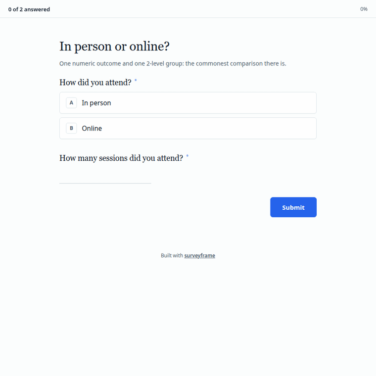
```

```{r two-group}
tg <- sframe_demo("two_group")
res <- run_analysis_plan(tg$responses, tg$instrument)
for (b in res) cat(b$test, ": ", b$apa, "\n", sep = "")
```

Both tests are declared, so you report both rather than choosing afterwards
whichever gave the smaller p value.

### The same people, measured twice

```{r paired-shot, echo = FALSE, out.width = "100%"}
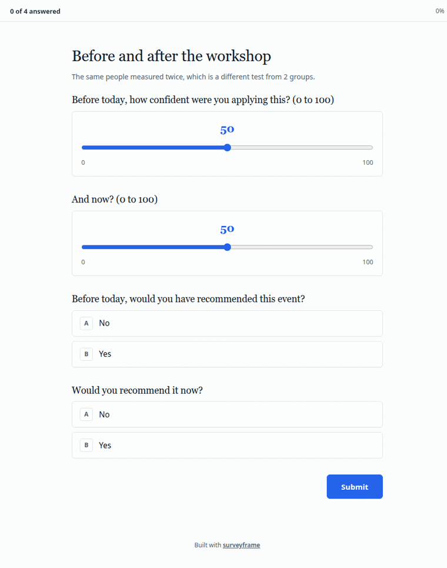
```

```{r paired}
pr <- sframe_demo("paired")
for (b in run_analysis_plan(pr$responses, pr$instrument)) {
  cat(b$test, ": ", b$apa, "\n", sep = "")
}
```

### Three groups, a second factor, and a covariate

```{r multi-group-shot, echo = FALSE, out.width = "100%"}
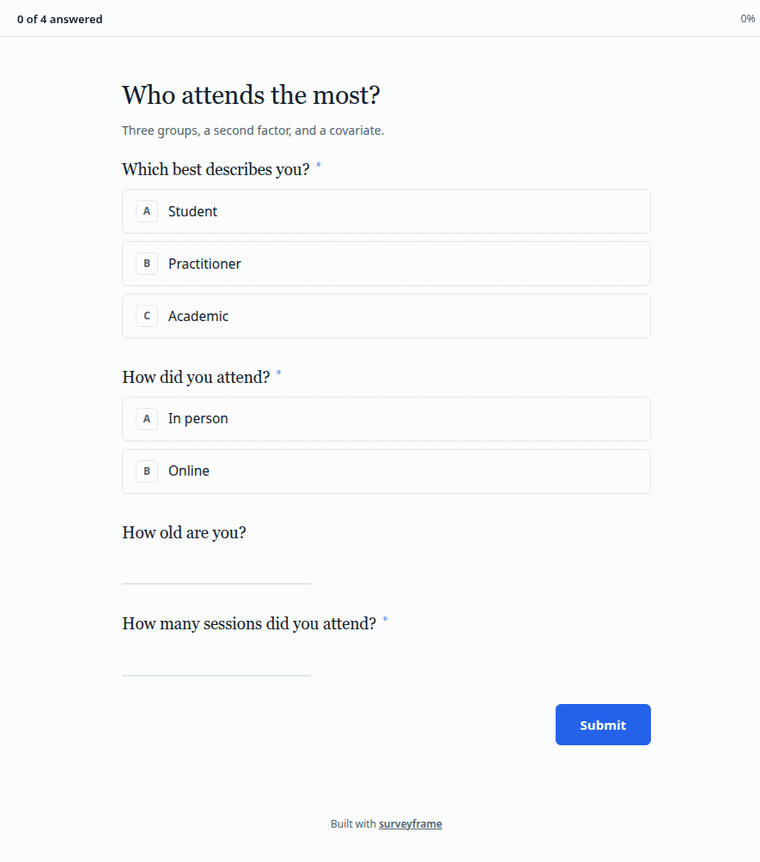
```

```{r multi-group}
mg <- sframe_demo("multi_group")
for (b in run_analysis_plan(mg$responses, mg$instrument)[1:2]) {
  cat(b$test, ": ", b$apa, "\n", sep = "")
}
```

`repeated` and `categorical` follow the same shape. See
`sframe_demo("repeated")` and `sframe_demo("categorical")`.

## Scales, structure and models

### A scale, and whether it holds together

```{r likert-shot, echo = FALSE, out.width = "100%"}
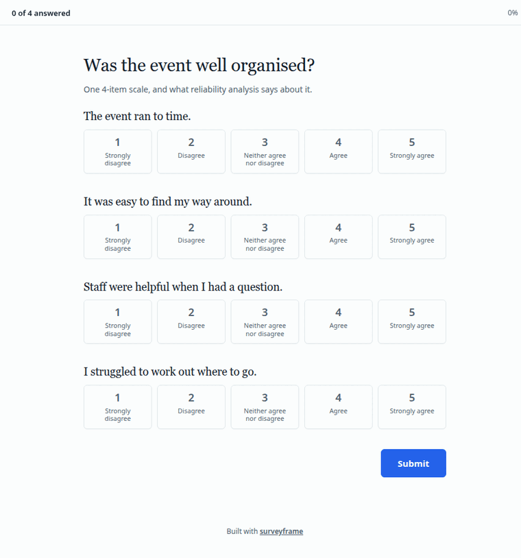
```

```{r likert}
ls_demo <- sframe_demo("likert_scale")
rel <- reliability_report(ls_demo$responses, ls_demo$instrument)
as.data.frame(rel)[, c("scale_id", "n_items", "alpha")]
```

One item is reverse worded and declared with `reverse = TRUE`, so scoring
handles it and you do not have to remember.

### Factor structure, and a path model

`factor_structure` asks whether the data supports the factors you assumed.
`sem_pls` declares three constructs and a path model, and generates the
syntax for both lavaan and seminr. The model type decides which: asking for
PLS syntax from a covariance-based model is refused, because it would
estimate a different model from the one you declared.

```{r sem}
sem <- sframe_demo("sem_pls")
vapply(sf_models(sem$instrument), function(m) m$type, character(1))
```

## Question types worth meeting

### A matrix item, and the columns it becomes

```{r matrix-shot, echo = FALSE, out.width = "100%"}
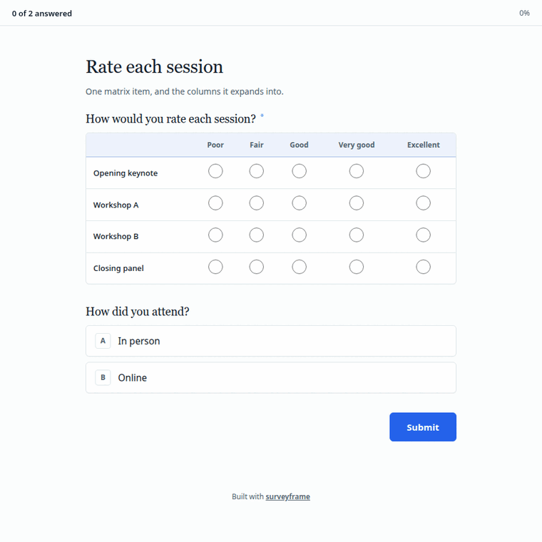
```

A matrix does not write one column named after the item. It **expands**, one
column per row:

```{r matrix}
ml <- sframe_demo("matrix_likert")
grep("^session__", names(ml$responses), value = TRUE)
```

`multiple_choice` and `ranking` expand the same way, one column per option.
See `sframe_demo("multi_response")`.

**A trap worth knowing.** When a matrix row label contains a space, the
column does too, and `read.csv()` will quietly rewrite
`session__Opening keynote` as `session__Opening.keynote`, which no longer
matches the contract the instrument declares. Read with
`check.names = FALSE`.

### Questions only some people see

```{r branching-shot, echo = FALSE, out.width = "100%"}
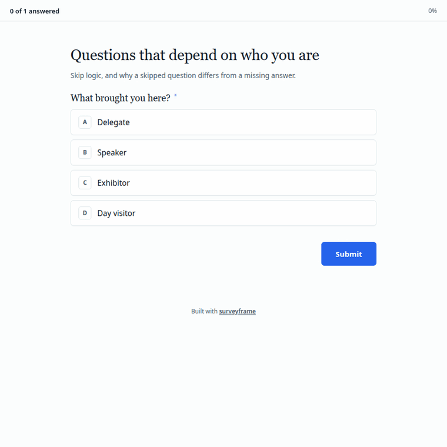
```

```{r branching}
br <- sframe_demo("branching")
sf_branches(br$instrument)[[1]]
```

A blank left by skip logic is **structural**, not missing data. The
respondent was never asked. That distinction matters when you report
completeness.

### Free text

```{r open-text}
ot <- sframe_demo("open_text")
tf <- run_analysis_plan(ot$responses, ot$instrument)[[1]]
head(tf$table, 5)
```

## Make it yours

Every demo above ships plain. The whole appearance of a survey lives in one
`render` block, which you can read, change and paste into your own
instrument:

```{r branding}
str(sframe_demo_branding(), max.level = 1)
```

Applied to any demo with `branded = TRUE`, which changes nothing on disk:

```{r branded, eval = FALSE}
sframe_demo("two_group", branded = TRUE)
```

Plain, then the welcome page a respondent meets first, then the questions:

```{r plain-shot, echo = FALSE, out.width = "100%"}
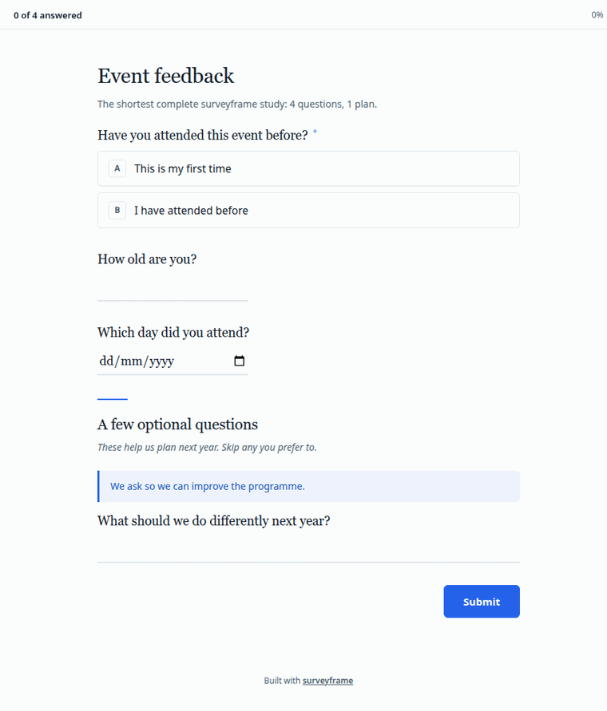
```

```{r welcome-shot, echo = FALSE, out.width = "100%"}
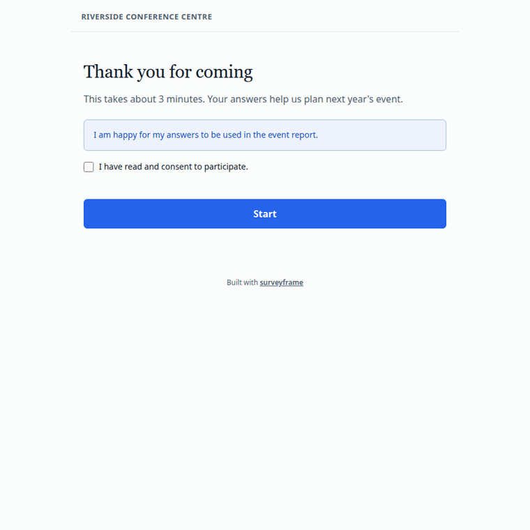
```

```{r branded-shot, echo = FALSE, out.width = "100%"}
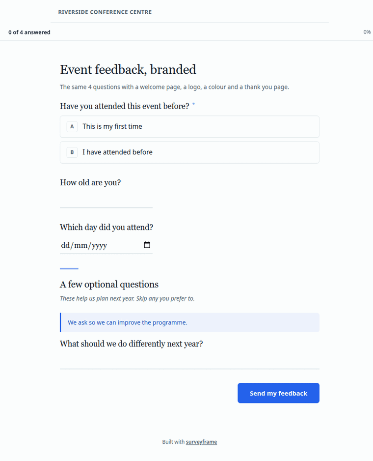
```

Consent is enforced rather than decorative: with `consent_required = TRUE`,
pressing Start without ticking the box refuses to continue.

### One page, or one question at a time

`render$mode` takes `"standard"`, which is everything on one page, or
`"conversational"`, which is one question at a time with a progress bar.

```{r conversational-shot, echo = FALSE, out.width = "100%"}
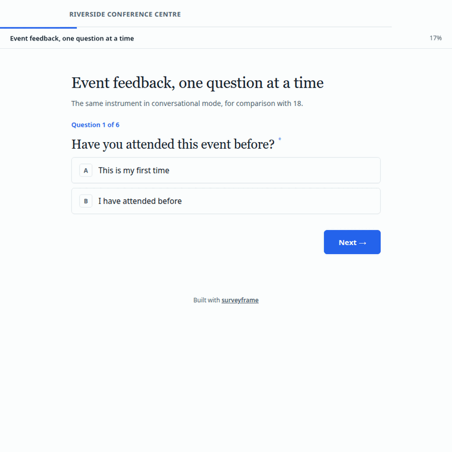
```

Conversational mode works with skip logic, which is the combination most
likely to surprise: a hidden question is stepped over without leaving the
respondent on a blank card.

```{r conv-branch-shot, echo = FALSE, out.width = "100%"}
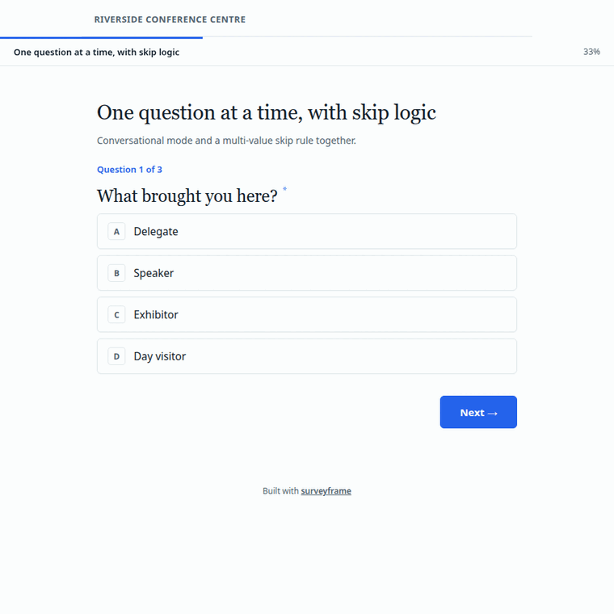
```

## Collect responses, and share the results

Three routes, and the same instrument serves all three.

```{r routes, eval = FALSE}
# 1. One self-contained HTML file you can host or email
export_static_survey(demo$instrument, "survey.html")

# 2. A Shiny app
render_survey(demo$instrument, mode = "shiny")

# 3. A Google Sheets collector, generated as an Apps Script
export_google_sheet(demo$instrument, sheet_url = "https://...")
```

Then the report:

```{r report, eval = FALSE}
render_report(demo$instrument, demo$responses, output_path = "report.html")
```

`render_report()` prefers Quarto and falls back to a built-in HTML writer.
**It tells you which one it used**, in a message, in an `engine` attribute on
the path it returns, and in the report itself beside the instrument hash and
the analysis seed. For a thesis or a journal, `plot_palette = "print"` swaps
the colour charts for greyscale, and `format = "pdf"` writes a PDF.

## Declare, revise, verify

This is what separates surveyframe from a form builder, and it is worth
seeing before you decide whether to use it.

### Changing an instrument mid-study, on the record

A pilot often shows that a question needs rewording. Doing that quietly
leaves nobody able to tell which version a respondent saw.

```{r amend}
rev <- sframe_demo("instrument_revision")
log <- as.data.frame(amendment_log(rev$instrument))
log[, c("reason_code", "tier", "reason_text")]
```

The amendment carries a reason code, a tier, an author and a deviation
report, and it travels inside the instrument.

### Proving a file is the one you think it is

Every `.sframe` carries a SHA-256 of its own contents. The demo ships a clean
file and a tampered copy, altered in a single response label with the stored
hash left alone:

```{r verify, error = TRUE}
v <- sframe_demo("verification")
tampered <- file.path(dirname(v$instrument_path), "verification_tampered.sframe")
read_sframe(tampered)
```

The file refuses to load. That is what the hash is for.

## Are you an instructor? Do you want to verify against established software?

Good. Please check us against the software you already trust.

Every demo ships four things: the instrument, the response data, a codebook
of variable and value labels, and the results surveyframe produced.

```{r artefacts}
d <- sframe_demo("two_group")
basename(unlist(d[c("instrument_path", "responses_path",
                    "codebook_path", "results_path")]))
```

Take them into `psych`, SPSS, JASP, jamovi or Stata, run the same test, and
compare.

```{r labelled, eval = FALSE}
sframe_export_labelled(d$responses, d$instrument, "two_group.sav")
```

The `.sav` arrives with the question wording and the response options already
attached, so your variables read "The event ran to time." and "Strongly
disagree" rather than `org_1` and `1`. **The plain CSV carries codes**, and
the codebook is what gives them meaning, so use one or the other.

**If a number comes out differently, we want to hear about it.** [Open an
issue](https://github.com/MohammedAliSharafuddin/surveyframe/issues) with the
demo name, the software you used, and both results. A disagreement is either
a bug worth fixing or a difference in method worth documenting, and we would
rather find out from you than not at all.

## Run one yourself

Each demo comes with a Quarto notebook: load, read, run the plan, render a
report, export for checking elsewhere.

```{r qmd, eval = FALSE}
sframe_demo_qmd("two_group")
```

Render it, then start replacing the demo with your own study.

## Found a bug, or something that could be clearer?

surveyframe is developed in the open at
[github.com/MohammedAliSharafuddin/surveyframe](https://github.com/MohammedAliSharafuddin/surveyframe).
Bug reports, questions, and suggestions for a demo that would have helped you
are all welcome on the [issue
tracker](https://github.com/MohammedAliSharafuddin/surveyframe/issues). If a
result looks wrong, please include the demo name and what you compared
against, since that turns a report into something fixable in one step.
